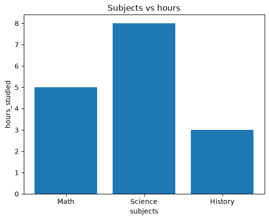

# 📝 Worksheet: 06 - Foundations

Use this worksheet to reinforce the Jupyter/IPython tooling skills from this module. Each section ends with an **🤖 Explain It** prompt — write your explanation in your own words, then (optionally) paste it into an AI tutor and ask it to point out anything you got wrong or left out.

---

## 🧙 Section 1: Magics and Performance

1. What magic command lists every variable currently in memory, along with its type?  
   `Answer:` ______%whos_________________

2. What's the difference between a line magic (`%pwd`) and a cell magic (`%%writefile`)?  
   `Answer:` A line magic starts with a single % and applies only to the current line. So %pwd works on one line and prints the current directory.A cell magic starts with %% and applies to the entire cell, including all lines below it. %%writefile uses everything in the cell to create or overwrite a file.

---

### ✏️ Task: Timing Comparison

```python
# Build a list of the first 500,000 integers.
# Use %timeit to compare: squaring it with a list comprehension
# vs. squaring it as a NumPy array (numbers ** 2).
```
import numpy as np

# Build a list of the first 500,000 integers
numbers = list(range(500_000))

# Create a NumPy array from the list
arr = np.array(numbers)

# List comprehension
%timeit [x**2 for x in numbers]

# NumPy vectorized operation
%timeit arr**2
` shows the result: 
26.5 ms ± 356 μs per loop (mean ± std. dev. of 7 runs, 10 loops each)
239 μs ± 5.76 μs per loop (mean ± std. dev. of 7 runs, 1,000 loops each)
`
### 🤖 Explain It

In your own words: why does `%timeit` run your code multiple times instead of just once like `%time`? What would you lose if it only ran once?

---
By running the code repeatedly and averaging the results, %timeit produces a more reliable and consistent estimate of the code's true performance.
## 📝 Section 2: Markdown

3. What's the difference between `*italic*` and `**bold**` in Markdown?  
   `Answer:` *italic* makes text italic.
**bold** makes text bold.

4. Write the Markdown for a 2-item bulleted list where the second item has its own sub-bullet.  
   `Answer:` 
- First item
- Second item
  - Sub-bullet
---

### ✏️ Task: Mini Report

```markdown
# Write a Markdown cell with:
# - a level-2 heading
# - a short paragraph
# - a 3-item list
# - one inline LaTeX expression
```
# The Significance of R² (Coefficient of Determination)

R², or the coefficient of determination, is a statistical measure that indicates how well a regression model explains the variation in a dependent variable. It is widely used in data science and analytics to evaluate the performance of predictive models.

- Measures the proportion of variance explained by the model
- Values range from 0 to 1
- Higher R² values generally indicate a better fit
- Helps compare different regression models

### R² Formula

$$
R^2 = 1 - \frac{SS_{res}}{SS_{tot}}
$$

Where:
- $(SS_{res})$ = Sum of Squared Residuals
- $(SS_{tot})$ = Total Sum of Squares
### 🤖 Explain It

In your own words: what's lost if you write an entire notebook as code + comments only, with no Markdown cells at all?

---
Markdown cells allow you to:

- Add section headings and organization
- Explain the purpose of your code
- Describe results and conclusions
- Include formatted text, lists, links, images, and LaTeX equations

Code comments can explain how the code works, but Markdown cells help tell the overall story of the notebook and make it read more like a report or tutorial.
## 📂 Section 3: Files and Data I/O

5. What does the `with` keyword do when you open a file, and why is it preferred over a plain `open()`/`.close()` pair?  
   `Answer:` The with keyword creates a context manager. When you open a file with with, Python automatically handles closing the file for you when the block ends, even if an error occurs inside the block.
6. What's the difference between `json.dump()` and `json.load()`?  
   `Answer:` json.dump() writes Python data to a JSON file and json.load() reads JSON data from a file and converts it back to Python objects.

7. Name three things `.info()` tells you about a DataFrame that `.head()` doesn't.  
   `Answer:` .info() shows the following three things about DataFrame:
 1. Data types of each column
 2. Non-null counts (missing-data information)
 3. Memory usage of the DataFrame.
 Howeever, .head() only shows the first few rows of the data.

---

### ✏️ Task: Build, Save, Reload

```python
# Create a dictionary describing yourself (name, major, hobbies as a list).
# Save it to a JSON file.
# Read it back into a NEW variable and confirm it matches the original
# (hint: compare the two dictionaries with ==).
```
# Create a dictionary describing yourself
my_info = {
    "name": "Nancy",
    "major": "Data Analytics",
    "hobbies": ["reading", "coding", "traveling"]
}
# Save it to a JSON file
with open("my_info.json", "w") as file:
    json.dump(my_info, file)
# Read it back into a NEW variable
with open("my_info.json", "r") as file:
    loaded_info = json.load(file)
# Confirm it matches the original
print(my_info == loaded_info)
```
Shows True after running the code. 
### ✏️ Task: CSV Round Trip

```python
# Create a small DataFrame from a dictionary of lists (not a CSV this time —
# use pd.DataFrame(your_dict)).
# Save it to a CSV, then read that CSV back into a new DataFrame.
# Use .equals() to confirm the reloaded DataFrame matches the original.
```
import pandas as pd

# Create a DataFrame from a dictionary of lists
data = {
    "Name": ["Nancy", "Alice", "John"],
    "Age": [25, 22, 27],
    "City": ["Wichita Falls", "Dallas", "Austin"]
}
df_original = pd.DataFrame(data)
# Save the DataFrame to a CSV file
df_original.to_csv("customers.csv", index=False)
# Read the CSV back into a new DataFrame
df_reloaded = pd.read_csv("customers.csv")
# Check whether the two DataFrames are identical
print(df_original.equals(df_reloaded))
```
shows True after running the code.
### 🤖 Explain It

In your own words: why does opening a file that doesn't exist raise a specific error (`FileNotFoundError`) instead of Python just quietly giving you an empty result?

---
Python raises a FileNotFoundError because a missing file is usually a mistake that the programmer should know about immediately.

## 📈 Section 4: Plotting

8. What does `plt.legend()` require in order to show meaningful labels (hint: think about the `plot()` calls before it)?  
   `Answer:` plt.legend() requires labels to be defined in the plt.plot() calls using the label= argument. Without those labels, plt.legend() does not know what names to display in the legend and may show an empty legend or a warning. 

9. When would you choose a bar plot over a line plot?  
   `Answer:` Bar plots are useful for comparing values across different categories, whereas line plots represent trends or changes over time or across a continuous range.. 

---

### ✏️ Task: Compare Three Categories

```python
# Given: subjects = ["Math", "Science", "History"]
#        hours_studied = [5, 8, 3]
# Build a bar plot with a title and axis labels.
```
import matplotlib.pyplot as plt
import numpy as np
subjects = ["Math", "Science", "History"]
hours_studied = [5, 8, 3]
# Build a bar plot with a title and axis labels.
plt.bar(subjects, hours_studied)
plt.title('Subjects vs hours')
plt.xlabel('subjects')
plt.ylabel('hours_studied')
plt.show()

``` shows the plots as below:

```
### 🤖 Explain It

In your own words: why does a line plot make sense for `sin(x)` but not for the bar-chart categories (`"Math"`, `"Science"`, `"History"`)? What's different about the two kinds of data?

---For a sine function, the x-values are part of a continuous range and for the bar-chart, it represents distinct categories, not points on a continuous scale. There is no meaningful value halfway between "Math" and "Science". Therefore, connecting them with a line would imply a relationship or continuity that doesn't exist.

## ⚡ Section 5: Productivity and Getting Help

10. What are the two Jupyter cell modes, and what does each one do?  
    `Answer:` Jupyter has two cell modes: Command Mode and Edit Mode. Command Mode (entered with Esc) is used for managing cells and notebook commands, while Edit Mode (entered with Enter) is used for writing and editing code or Markdown within a cell.

11. What's the difference between `help(len)` and `len?`?  
    `Answer:` help(len) is the standard Python way to view documentation and works everywhere. len? is an IPython/Jupyter shortcut that displays the same type of information in a more convenient notebook format.

---

### ✏️ Task: Shortcut Drill

```
Using only the keyboard (no mouse):
- Insert 2 new cells below this one.
B
B
- Turn one into a Markdown cell and the other into a Code cell.
M
Y
- Delete one of them.
D D
- Run the remaining cell.
   PRESSING SHIFT+Enter
```

### 🤖 Explain It

In your own words: when would you reach for `?` versus `??` versus `help()` versus searching online documentation? Is there a natural order you'd try them in?

---I would usually try ? first for a quick summary, then ?? if I need more detail or source code, then help() for the full docstring. If I'm still confused or need examples and best practices, I'd search the online documentation.

## 🧾 Submit Checklist

- [x] I used at least 3 different magic commands.
- [x] I wrote a Markdown cell with a heading, a list, and LaTeX math.
- [x] I wrote and read back a text file, a JSON file, and a CSV file.
- [x] I built at least one plot with a title, axis labels, and (if applicable) a legend.
- [x] I used `?` or `help()` to look something up instead of guessing.
- [x] I completed the "Explain It" prompts in my own words.
